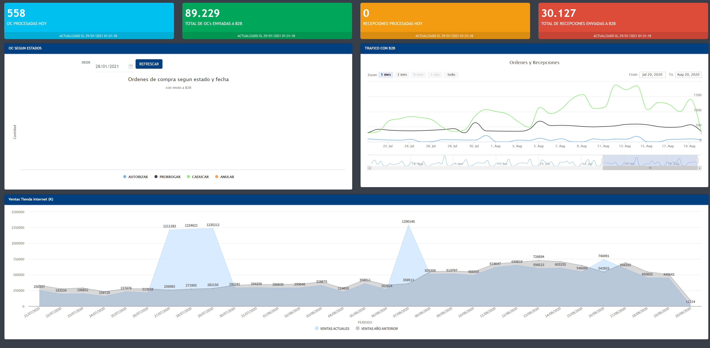

# ATOM User Controls - myHighChart

Esta guía es una descripción básica de como se construyó el UC myHighChart, el que esta publicado en el MarketPlace de GeneXus. La idea es que todo aquel que quiera aprender, partiendo de lo básico, esta guía les pueda servir.
Sin duda, hay muchas detalles mas que se deben explicar, pero para iniciar y para este UC, creo que esto bastará.

## Descarga de la versión oficial en el Marketplace

[Puedes descargarla desde aquí](http://bit.ly/2XVyCZX)

## Conocimientos necesarios

Es deseable que conozcan lo siguiente, en términos generales, no necesariamente se aplica todo para este UC:

1. Javascript
2. CSS
3. JQuery
4. HTML5
5. GeneXus Theme editor
6. Libreria de HighChart. La idea es que vean los ejemplos y su documentación. De eso depende la definición del SDT. Si una propiedad no esta en el SDT, solo basta que la agreguen, eso si, donde corresponde según lo que indica la librería (https://www.highcharts.com/demo). Actualmente soporta los graficos de HighChart y Stock, El resto no se soporta o no se ha probado.


## Preparación del entorno de programación

Pasos:

- Descargar [Atom](https://atom.io)
- Descargar plugins de GeneXus. Para ello vamos a preferencias y elegimos install y buscamos GeneXus


*Todo queda instalado en pestaña Packages*

- Vamos a la pestaña Packages y seleccionamos GeneXus. Aparecerá las siguientes pantallas.


*imagen 1*


*imagen 2*

---

Donde:

| CAMPO               | DESCRIPCIÓN                                                               |
|---------------------|---------------------------------------------------------------------------|
| Name                | Se escribe el nombre del UC, en este caso tiene "RAMP_myHIGHCHART"        |
| Description         | Va la descripción del UC, en este caso, "my HIGHCHARTS"                   |
| Type                | Esto se deja tal cual, es decir "Common"                                  |
| Supported Platforms | Como estamos haciendo un UC para la web, dejamos marcado la casilla "web" |
| Path                | Acá va la ruta donde se dejara el UC.                                     |

*Esto va a generar una estructura básica para el UC, aquí recomiendo sustituir por el contenido del UC, si quieren seguir los fuentes publicados*

## Estructura base del UC

A continuación, se explicaran solo los archivos importantes o lo que debemos modificar para crear nuestro UC.


### Carpeta Build
Esta carpeta va a contener el empaquetado de nuestro UC una vez que lo generemos. (ver imagen 1). En el menú "Build", tenemos la opción "Debug" y "Release". Por experiencia, la Release no trabaja muy bien. La diferencia entre estas 2 opciones, es que la ultima comprime los archivos (no todos :( ), cosa que siempre podemos lograr por otras vías.

### SRC
Esta carpeta va a contener todo los fuentes de nuestro UC.

*Nota:* El resto de los archivos o carpetas, son propios del plugins y no se deben tocar, ademas, algunos perteneces a git.

### Estructura del UC

A continuación dejo la estructura de como se organizó Si se fijan de la estructura original, esta un poco diferente. Esto es optimo para cuando ha varios UC en una misma carpeta. En este caso, todos los UC que tengo estan en la carpeta RAMP dentro de la carpeta WEB, por ejemplo:

```

RAMP/
  \_ ADDONS
  \_ GENELA
  \_ myHIGHCHART
  \_ Shared

```

*Estructura típica en mis UC*

Se creo la carpeta llamada myHIGHCHART y movieron los archivos (imagen):


Luego se edita el archivo control, el cual queda en la raíz del SRC.

---

### Archivo Control

Este archivo es muy importante. Aqui se configuran las dependencias (archivos js), la versión, el nombre que va a tener en la paleta de herramientas de GeneXus y su organización, el XPZ a importar, métodos que aparecerán en GeneXus, etc.

Se detallaran las partes importantes del archivo que se crea por defecto. El resto de lo que no se mencione, esta tal cual el original.


```

<Version>0.0.15</Version>

```

Este almacena la versión del UC. Es importante por 2 motivos:            
1. GeneXus determina con esa versión si debe actualizar el UC ya instalado     
2. Para el MarketPlace, debe tener el formato  acorde para que pueda ser publicado

---

```

<RuntimeRender>myHIGHCHARTS\RAMP_myHIGHCHARTSRender.js</RuntimeRender>
<PropertiesDefinition>myHIGHCHARTS\RAMP_myHIGHCHARTSProperties.xml</PropertiesDefinition>
<DesignRender>myHIGHCHARTS\RAMP_myHIGHCHARTSRender.xsl</DesignRender>

```

Estos son los archivos que movimos al a carpeta creada, por lo tanto se debe reflejar la ruta en la que están ahora. por ejemplo, se agrego "myHIGHCHARTS\" atrás del archivo, lo que corresponde a la carpeta que agregamos.

---

```

<GxResources>myHIGHCHARTS\MYHC_OBJS.xpz</GxResources>

```

Claramente, le indico el XPZ a usar y donde esta. Este XPZ se importa luego de arrastrar el control a un webpanel. Este XPZ lo vamos construyendo a medida que creamos el UC, ya que el SDT debe estar bien alineado con lo que vamos a hacer en el UC con JS.

*Contenido*


---

```

<ReferencedFiles>
  <File>myHIGHCHARTS/assets/lib/highcharts/highcharts.js</File>
  <File>myHIGHCHARTS/assets/lib/highcharts/highcharts-3d.js</File>
  <File>myHIGHCHARTS/assets/lib/highcharts/highcharts-more.js</File>
  <File>myHIGHCHARTS/assets/lib/highcharts/modules/stock.js</File>
  <File>myHIGHCHARTS/assets/lib/highcharts/modules/funnel.js</File>
  <File>myHIGHCHARTS/assets/lib/highcharts/modules/solid-gauge.js</File>
</ReferencedFiles>

```

Acá le indico que archivos debe importar al renderizar la pagina. Esto es parte de lo que viene con la librería con GX.

*nota:* En vez de usar la librería de HighChart se pueden bajar versiones mas actualizadas de la pagina oficial y usarlas. Para ello se debe modificar lo mencionado anteriormente e incluirlos acá en el UC.

---

```

<Categories>
  <Category>RAMP.ADDONS</Category>
</Categories>

```

Esto sirve para crear la categoría donde va a presentar en la paleta de controles de GX.


---

```

<ToolboxIcon>myHIGHCHARTS\HC.ico</ToolboxIcon>

```

Seguramente esto no lo van a encontrar en el archivo *.control*, pero si lo agregamos podremos poner un icono a nuestro control en la paleta de controles de GeneXus. Deben fijarce que todo esta según la carpeta donde dejamos el icono, en este caso esta en "myHIGHCHARTS\".

---

```

<Methods>
  <Method>
    <Name>refresh</Name>
    <FullName>refresh</FullName>
    <Signature>refresh(config:config, tc:tc)</Signature>
    <Parameters>
      <Parameter>Character</Parameter>
      <Parameter>Character</Parameter>
    </Parameters>
    <ReturnType/>
  </Method>
</Methods>

```

Aquí agregamos un método, el que usaremos para refrescar nuestro gráficos y así poder tener un refresco automático, por ejemplo si usamos el UC Timer.
El método se llamara "Refresh", sus parámetros en este caso serán 3.

| PARAMETRO          | DESCRIPCION                                                                            |
|--------------------|----------------------------------------------------------------------------------------|
| CONFIG             | Corresponde a la definición del gráfico según la librería original. (ver documentación de la librería) |
| TC                 | Tipo de gráfico |

En GeneXus se usaría así:

```

 &SDT_HC_CONFIG = DP_HC_OCE_conf(&DESDE)
 &JSON = &SDT_HC_CONFIG.ToJson()

 // fix's al JSON
 &JSON = &JSON.Replace("fromm", "from")
 &JSON = &JSON.Replace('"\', '"')
 &JSON = &JSON.Replace('\"', '"')
 &JSON = &JSON.Replace('"[', "[")
 &JSON = &JSON.Replace(']"', "]")
 HC_UC.refresh(&JSON,HC_typeChart.chart)

```

*Ejemplo de SDT en XPZ*


*se uso con ww+*




---

### Archivo Render JS

En este archivo se denomina "RAMP_myHIGHCHARTSRender.js" el cual va a contener todo el código javascript del control.

Empezaremos por el método *Show*. aquí solo debemos crear el contenedor del gráfico, al cual le damos ancho máximo (100%) y altura por parámetro.

```

this.show = function () {
  if(!this.IsPostback){
    let template = '<div id={{id}} style="width:100%;height:{{height}};"></div>';
    let html = '';
    if(Mustache){
        let data = {
          id: this.ControlName + this.ControlId + '_MainContainer',
          height: this.Height
        };
        html = Mustache.to_html(template, data);
    }else{
      html = template;
      html = template.replace('{{id}}', this.ControlName + this.ControlId + '_MainContainer');
      html = template.replace('{{height}}', this.Height);
    }
    this.setHtml(html);
  }
}

```

Básicamente, definimos una variable , donde le asignamos el contenedor en html, la altura del mismo y luego lo enviamos a renderizar. La función principal de este JS es crear el DIV con el Id que permitirá individualizar el contenedor, el cual, por ejemplo, se podría buscar fácilmente con JQUERY.

Continuamos con el método *refresh*.

```

this.refresh = function(config, tc) {
  let json = gx.json.evalJSON(config);
  let dom = gx.dom.byId(this.ControlName + this.ControlId + '_MainContainer');
  $(dom).highcharts(tc, json);
}

```

A pesar del nombre, este se encarga de dibujar el gráfico y si necesita refrescarlo, por ejemplo si se quieren implementar un gráfico que cambie según cambia la data, solo debe invocar a este método nuevamente. Acá básicamente se le pasa el tipo de gráfico (variable tc), las propiedades o parámetros que definen la configuración del gráfico (variable config que va en formato JSON).

---

### Archivo Properties (XML)

Archivo que permite crear propiedades que puedes ser usadas en el control. Estas propiedades, dependiendo de la programación, pueden ser usadas en la paleta de propiedades de GX como en el código fuente.
Un ejemplo de propiedades seria:

```

 <Prop>
   <Id>Height</Id>
   <Name>Height</Name>
   <Type>Text</Type>
   <Default>400px</Default>
   <Metadata>
     <Value name="FlagScope">Designtime &amp; Runtime</Value>
   </Metadata>
 </Prop>

```

donde:

| PARAMETRO          | DESCRIPCION                                                                            |
|--------------------|----------------------------------------------------------------------------------------|
| Id                 | Id de la propiedad que será usada internamente |
| Name               | Nombre de la propiedad que usaremos en GX. Normalmente se usa el mismo nombre del Id |
| Type               | Tipo de dato que soporta, puede ser Text, Integer, Combo, Color, ComboInt, Boolean y Attribute. |
| Default            | Valor por defecto que va a tener la propiedad, en este caso es "400px" |
| Metadata, Value    | define propiedades en las que podemos decir que esta se le permite, cambiar la propiedad en el codigo fuente, dejarlo solo lectura o solo para ser usado en las propiedades. |

*** ejemplos ***

```

// Integer
<Prop>
  <Id>dia</Id>
  <Name>dia</Name>
  <Type>Integer</Type>
  <Default></Default>
</Prop>

// Combo
<Prop>
  <Id>mes</Id>
  <Name>mes</Name>
  <Type>Combo</Type>
  <Default></Default>
  <Metadata>
    <Values>
    <Value if="ene" desc="enero"/>
    <Value if="feb" desc="febrero"/>
    <Value if="mar" desc="marzo"/>
    <Value if="abr" desc="abril"/>
    <Values>
  </Metadata>
</Prop>

// Boolean
<Prop>
  <Id>Activo</Id>
  <Name>Activo</Name>
  <Type>Boolean</Type>
  <Default>false</Default>
</Prop>

```

Cada uno de estos estan agrupados, los cuales nos permiten generar propiedades ordenadas.

```

<Group>
  <Name>General</Name>
  <Type>Main</Type>
  <Children>
    <Group>
      <Name>SDT_Data</Name>
      <Childs>
        ...
      </Childs>
    </Group>
  </Children>
</Group>

```


---

### Archivo Render XSL

Acá, básicamente configuramos el icono o imagen que se despliega en el editor del webpanel, que representa al control mismo.


Para ello, modificaremos lo siguiente

*Parte del contenido del archivo ...*

```

...
<xsl:template name="RenderRAMP_myHIGHCHARTS">
  <span atomicselection="true">

    <xsl:call-template name="AddStyleAttribute"/>
    

      <xsl:attribute name="src">

        <xsl:value-of select="gxca:GetMyPath()"/>
        <xsl:text>\myHIGHCHARTS\myHC.png</xsl:text>
      </xsl:attribute>

      <xsl:call-template name="AddStyleAttribute"/>
    </img>
  </span>
</xsl:template>
...

```

En esta sección solo modificamos, dandole la ruta de donde tenemos la imagen que representa nuestro control *<xsl:text>\myHIGHCHARTS\myHC.png</xsl:text>*.
